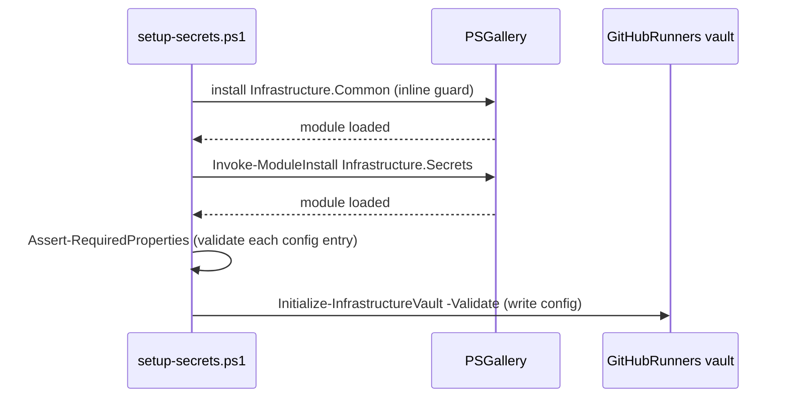
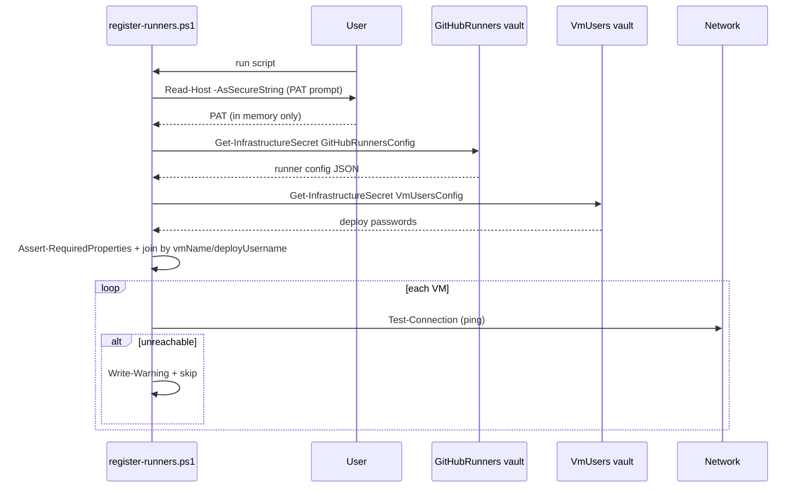
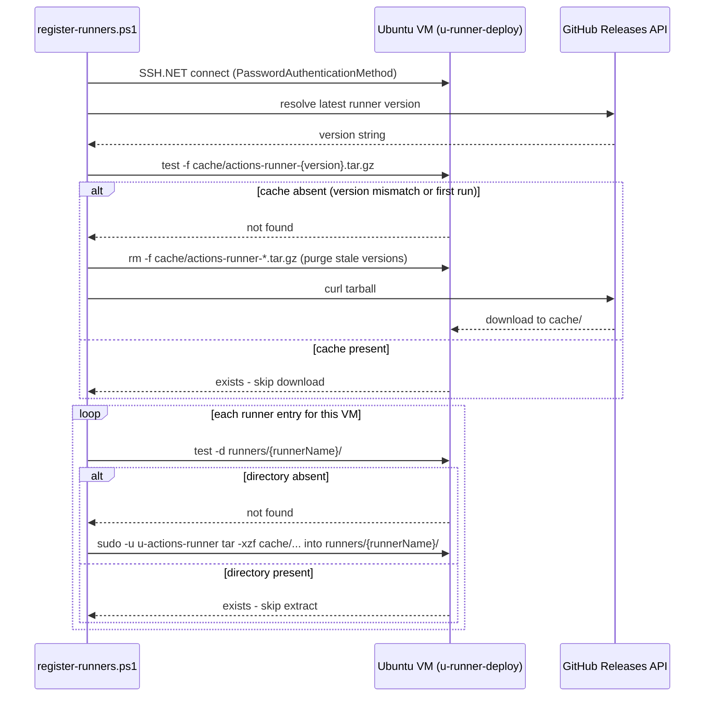
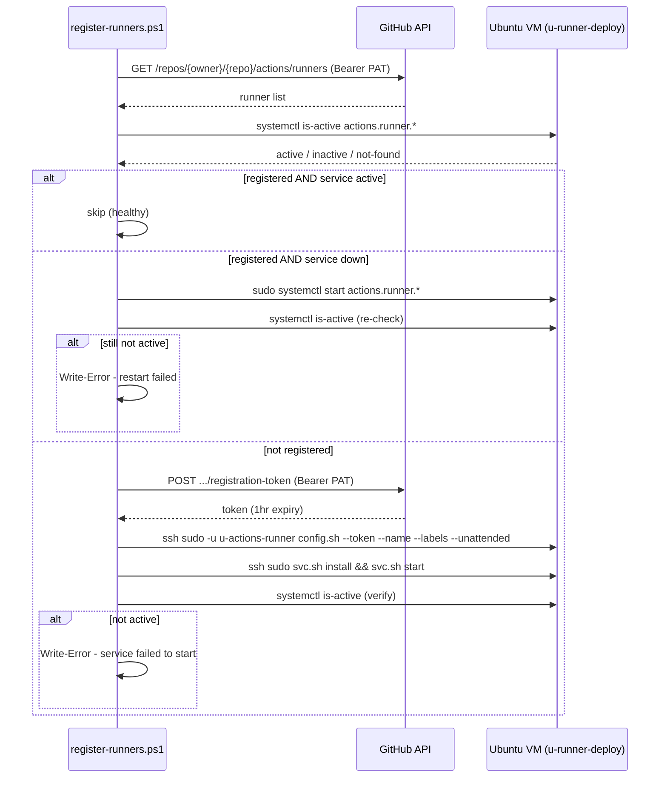

# Implementation Plan

## Index
- [Conventions](#conventions)
- [Step 1 - Repo skeleton](#step-1---repo-skeleton)
- [Step 2 - setup-secrets.ps1](#step-2---setup-secretsps1)
- [Step 3 - register-runners.ps1: vault read + validation](#step-3---register-runnersps1-vault-read--validation)
- [Step 4 - register-runners.ps1: runner install via SSH](#step-4---register-runnersps1-runner-install-via-ssh)
- [Step 5 - register-runners.ps1: registration + service](#step-5---register-runnersps1-registration--service)
- [Step 6 - README.md](#step-6---readmemd)

---

## Prerequisites

- VMs are provisioned by **Infrastructure-Vm-Provisioner**.
- `u-runner-deploy` and `u-actions-runner` are created on each VM by
  **Infrastructure-Vm-Users** before this script is run.
  - `u-runner-deploy`: SSH-accessible deploy user; sudoers scoped to runner
    operations only.
  - `u-actions-runner`: no-login service user that owns and runs the runner
    process.
- This repo never requires admin credentials — all SSH is done as
  `u-runner-deploy`.

---

## Conventions

- Each logical operation (vault read, ping, SSH connect, runner install,
  registration, service management) is extracted into its own function.
  `register-runners.ps1` is the orchestrator; it calls functions, it does
  not contain inline logic.
- Tests are written alongside each step — unit tests mock all external
  calls (SSH, vault, GitHub API, network); integration tests run against
  a real SSH target in Docker (same pattern as Infrastructure-Vm-Users).
- Test files mirror the production file structure under `Tests\`.

---

## Step 1 - Repo skeleton

**What:** Create the directory structure and placeholder files.

```
hyper-v/
└── ubuntu/
    ├── register-runners.ps1    (empty)
    └── setup-secrets.ps1       (empty)
```

**Why:** Matches the `hyper-v/ubuntu/` convention used by
Infrastructure-Vm-Provisioner and Infrastructure-Vm-Users.

---

## Step 2 - setup-secrets.ps1

**What:** Script that stores the runner JSON config in the local vault.
Follows the exact bootstrap pattern from Infrastructure-Vm-Provisioner
(`hyper-v/ubuntu/setup-secrets.ps1`):

1. Inline guard installs/imports `Infrastructure.Common` (the only install
   logic that cannot use `Invoke-ModuleInstall` — the function isn't
   available until the module is loaded).
2. `Invoke-ModuleInstall` (from `Infrastructure.Common`) installs and imports
   `Infrastructure.Secrets`, version-gated.
3. `Initialize-InfrastructureVault` called with:
   - Vault: `GitHubRunners`
   - Secret: `GitHubRunnersConfig`
   - `-Validate`: scriptblock that calls `Assert-RequiredProperties` (from
     `Infrastructure.Common`) on each entry — validation runs inside
     `Initialize-InfrastructureVault` before the vault is touched.

**Multi-repo constraint** - a repo-level runner is bound to exactly one
repo (no org). To cover multiple repos on the same VM, register one
runner process per repo. Each entry in the config is one runner process;
multiple entries with the same `vmName` are valid and expected. Re-running
the script with a new entry adds the new runner without disturbing
existing ones.

**Runner label conventions** - at minimum, register two runners per VM
with distinct purpose labels:

| Purpose | Suggested labels | Workflows that target it |
|---|---|---|
| General CI | `self-hosted`, `ubuntu`, `x64` | Build, test, lint |
| Infra/deploy | `self-hosted`, `ubuntu`, `x64`, `infra` | Provisioning, secret setup, SSH-based deploy |

Keeping infra workflows on a dedicated runner is a security boundary: a
compromised job on the general runner cannot reach the secrets vaults or
SSH credentials that infra workflows use. Workflows opt in explicitly via
`runs-on: [self-hosted, infra]`.

Add further labels (e.g. `gpu`, `high-mem`) only when a workflow
actually requires them — premature specialisation adds VMs to maintain.

**Config schema** - `u-runner-deploy` credentials only; admin credentials
are never needed or stored; PAT is prompted at runtime:
```jsonc
[
  // Two runners on the same VM: one per purpose.
  // To add a new repo later, append a new entry with the same vmName.
  {
    "vmName":         "ubuntu-01-ci",
    "ipAddress":      "192.168.1.101",
    "deployUsername": "u-runner-deploy",
    // No deployPassword here. The password is read from the VmUsers vault
    // at runtime - Infrastructure-Vm-Users is the canonical owner.
    "githubUrl":      "https://github.com/user/repo-a",
    "runnerName":     "ubuntu-01-ci",         // general CI runner
    "runnerLabels":   ["self-hosted", "ubuntu", "x64"]
  },
  {
    "vmName":         "ubuntu-01-ci",
    "ipAddress":      "192.168.1.101",
    "deployUsername": "u-runner-deploy",
    "githubUrl":      "https://github.com/user/repo-a",
    "runnerName":     "ubuntu-01-ci-infra",   // isolated infra/deploy runner
    "runnerLabels":   ["self-hosted", "ubuntu", "x64", "infra"]
  },
  {
    "vmName":         "ubuntu-01-ci",
    "ipAddress":      "192.168.1.101",
    "deployUsername": "u-runner-deploy",
    "githubUrl":      "https://github.com/user/repo-b", // second repo, same VM
    "runnerName":     "ubuntu-01-ci-repo-b",
    "runnerLabels":   ["self-hosted", "ubuntu", "x64"]
  }
]
```

**Why:** Same vault pattern as Infrastructure-Vm-Provisioner. Using
`Invoke-ModuleInstall` instead of a raw `Install-Module` call centralises
version-gating and avoids duplicating install logic across repos.
Passing `-Validate` to `Initialize-InfrastructureVault` is the
established pattern — validation fails fast before any vault state is
changed. Admin credentials are excluded — the deploy user was created by
Infrastructure-Vm-Users with the minimum permissions required. PAT is
excluded because it rotates — prompting at runtime avoids stale
credentials.



---

## Step 3 - register-runners.ps1: vault read + validation

**What:** Opening section of `register-runners.ps1` that:
1. Imports `Infrastructure.Common` (install guard, same inline pattern as
   Step 2 — `register-runners.ps1` is run independently so it cannot rely
   on setup-secrets.ps1 having been run in the same session).
2. Prompts for the GitHub PAT via `Read-Host -AsSecureString` - never
   stored, used only in-process for the duration of the script.
3. Reads `GitHubRunnersConfig` from the `GitHubRunners` vault using
   `Get-InfrastructureSecret` (from `Infrastructure.Secrets`) — the
   abstraction isolates all vault reads behind a single swappable call.
4. Reads `VmUsersConfig` from the `VmUsers` vault using
   `Get-InfrastructureSecret` — extracts the `password` for each
   `deployUsername` entry. This vault is the canonical source of deploy
   credentials; no password is stored in the `GitHubRunners` vault.
5. Calls `Assert-RequiredProperties` (from `Infrastructure.Common`) on each
   runner config entry to validate required fields.
6. Joins runner entries to deploy passwords by `vmName` + `deployUsername`
   — warns and skips any entry with no matching password in VmUsers config.
7. Checks each VM with a ping - warns if unreachable, skips that entry.
8. Emits structured output for each decision.

**Why:** Fail fast on bad config before opening any SSH connections.
Reading deploy credentials from the `VmUsers` vault makes
Infrastructure-Vm-Users the single source of truth — passwords are not
duplicated across vaults. `Get-InfrastructureSecret` isolates the vault
implementation so that swapping the secret backend (e.g. to Azure Key
Vault) requires a change in one place in Infrastructure.Secrets, not in
every consumer script.



---

## Step 4 - register-runners.ps1: runner install via SSH

**What:** For each reachable VM:
1. Open an SSH connection as `u-runner-deploy` using SSH.NET directly
   (same pattern as `create-users.ps1` in Infrastructure-Vm-Users):
   construct `PasswordAuthenticationMethod` + `ConnectionInfo` +
   `SshClient`, then call `Invoke-SshClientCommand` (from
   `Infrastructure.Common`) for all remote commands. Posh-SSH is
   installed via `Invoke-ModuleInstall` solely for its bundled
   `Renci.SshNet.dll`. The password must never be logged.
2. Resolve the latest runner version from the GitHub Releases API.
3. Check for a cached tarball at
   `/home/u-actions-runner/cache/actions-runner-{version}.tar.gz`.
   If absent, purge any stale `actions-runner-*.tar.gz` files from the
   cache directory first, then download from GitHub Releases via `curl`.
   The tarball is the same binary regardless of which repo a runner is
   registered to, so one download serves all runners on the VM.
4. For each runner entry targeting this VM: if the runner directory
   `/home/u-actions-runner/runners/{runnerName}/` is absent, extract
   from the cached tarball into it as `u-actions-runner` (via
   sudoers-permitted `sudo -u u-actions-runner`). Skip if already present.

**Why:** Separate directories per runner name allow multiple runners per VM
without conflict. A shared tarball cache avoids re-downloading ~100 MB
per additional runner on the same VM — the binary is identical across
registrations. Using `sudo -u u-actions-runner` to extract ensures all
files are owned by the service user from the start, without granting
`u-runner-deploy` broader write access. Using SSH.NET directly via
`Invoke-SshClientCommand` matches the established pattern in
Infrastructure-Vm-Users and avoids the Posh-SSH 3.x key-exchange bug.

**Security note:** `deployPassword` must never appear in console output,
error messages, or SSH command strings. Log only `vmName` and
`deployUsername` in diagnostics.



---

## Step 5 - register-runners.ps1: registration + service

**What:** For each VM:
1. Check GitHub API for an existing runner with the given name
   (GET `/repos/{owner}/{repo}/actions/runners`, authenticated with
   `Authorization: Bearer {PAT}`). Required PAT scope: `repo` for
   private repos, `public_repo` for public. The PAT is the one already
   held in memory from Step 3 — it is never re-prompted or logged.
2. Check local service state via `systemctl is-active actions.runner.*`.
3. Three-way branch on (registered, service-active):
   - **Both true**: skip entirely - runner is healthy.
   - **Registered but service down**: attempt `systemctl start` as
     `u-runner-deploy` (sudoers-permitted); write a clear error to the
     console and abort this runner entry if the restart fails or the
     service is still not active afterward.
   - **Not registered**: fetch a short-lived registration token
     (POST `.../actions/runners/registration-token`, 1hr expiry), run
     `config.sh` as `u-actions-runner` (via sudoers) with the token,
     runner name, labels, and `--unattended`, then install and start the
     systemd service via `svc.sh install` + `svc.sh start` (sudoers).
4. After any start or restart: re-check `systemctl is-active` and write
   a prominent error (red `Write-Error`) if the service is still not
   active - never swallow the failure silently.

**Why:** Checking the GitHub API for an existing runner by name prevents
duplicate registrations. A service that is registered but stopped needs
a restart, not a fresh registration (which would create a duplicate).
Registration token expires in 1 hour - fetching immediately before use
avoids stale-token failures. Explicit post-start verification ensures
the operator always knows whether the runner is actually accepting jobs.



---

## Step 6 - README.md

**What:** Root `README.md` covering:
- Prerequisites (Windows 11, OpenSSH, VMs provisioned,
  Infrastructure-Vm-Users run first).
- Quick start (setup-secrets -> register-runners).
- JSON config reference — include a full annotated example matching the
  schema from Step 2 (vmName, ipAddress, deployUsername, githubUrl,
  runnerName, runnerLabels), with a note that `deployPassword` is read
  from the VmUsers vault at runtime and must not appear here.
- PAT requirements: `repo` scope for private repos, `public_repo` for
  public. Used for listing runners (GET) and fetching registration
  tokens (POST). Prompted at runtime, never stored.
- Idempotency behaviour.
- Multi-repo and multi-purpose runner setup: explain that repo-level
  runners are 1:1 with a repo (no org), that multiple entries with the
  same `vmName` are how you cover multiple repos on one VM, and that
  re-running the script safely adds new runners without disturbing
  existing ones. Include the recommended two-purpose pattern (general CI
  + `infra`) and its security rationale.
- Repo structure.

**Why:** Required after each step per global instructions; primary
onboarding document for the repo.
