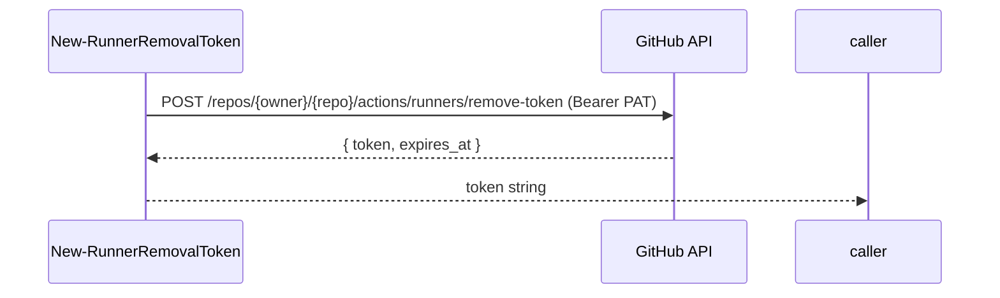
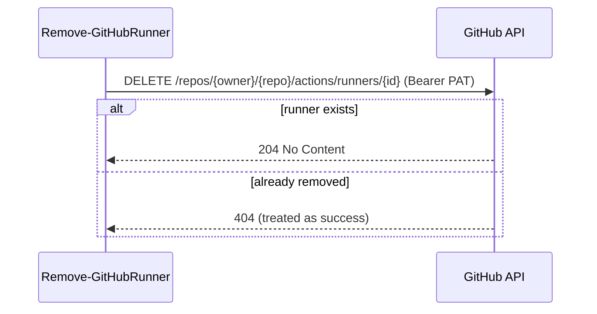
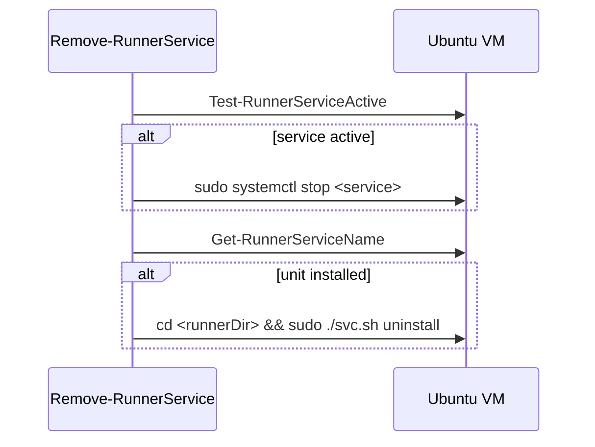
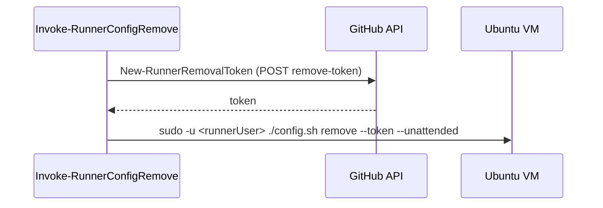
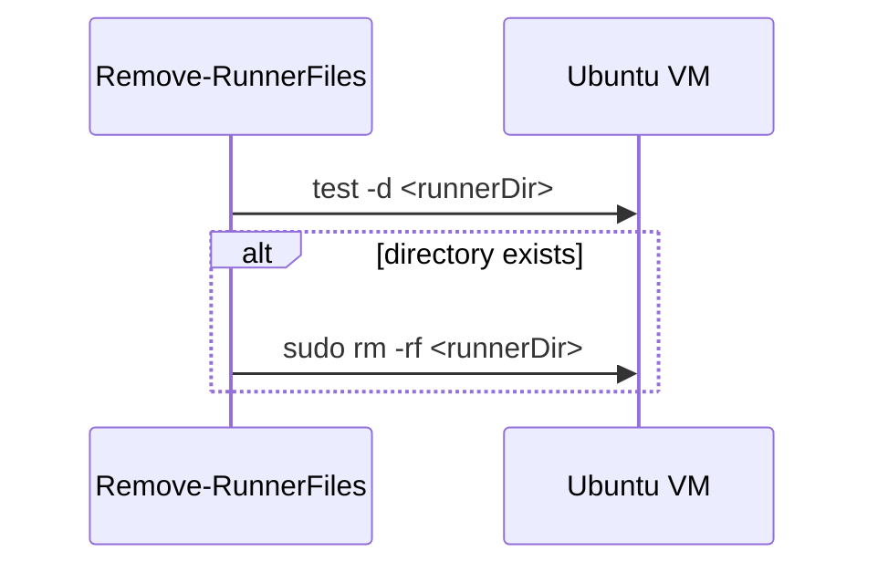
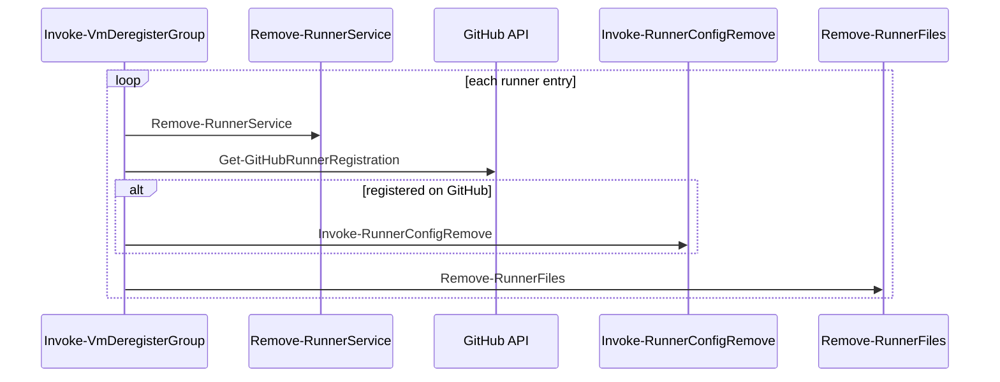
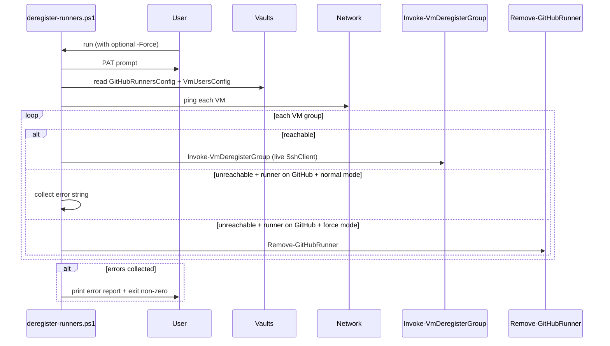

# Implementation Plan

## Index
- [Prerequisites](#prerequisites)
- [Conventions](#conventions)
- [Step 1 - Restructure existing folders](#step-1---restructure-existing-folders)
- [Step 2 - New-RunnerRemovalToken](#step-2---new-runnerremovaltoken)
- [Step 3 - Remove-GitHubRunner](#step-3---remove-githubrunner)
- [Step 4 - Remove-RunnerService](#step-4---remove-runnerservice)
- [Step 5 - Invoke-RunnerConfigRemove](#step-5---invoke-runnerconfigremove)
- [Step 6 - Remove-RunnerFiles](#step-6---remove-runnerfiles)
- [Step 7 - Invoke-VmDeregisterGroup](#step-7---invoke-vmderegistergroup)
- [Step 8 - deregister-runners.ps1 orchestrator](#step-8---deregister-runnersps1-orchestrator)

---

## Prerequisites

- Feature 01 complete: `register-runners.ps1` exists and the vault schema
  is established.

---

## Conventions

- Folders are grouped by the domain they operate on, not by operation
  direction (register vs. deregister):

  | Folder | Domain |
  |---|---|
  | `config/` | Vault reads, JSON parsing, credential joining |
  | `infra/` | Connectivity checks, path computation |
  | `github/` | GitHub REST API calls |
  | `service/` | Systemd service management |
  | `binary/` | Runner binary lifecycle (tarball, extract, install, remove) |
  | `registration/` | config.sh lifecycle (register and deregister) |

- Tests mirror the production structure under `Tests/`.
- Every step is committed and reviewed independently before proceeding.
- `README.md` is updated as part of every step - not deferred to the end.
- See [feature 01 conventions](../01%20-%20initial%20implementation/plan.md#conventions)
  for SSH, mocking, and test structure rules.

---

## Step 1 - Restructure existing folders

**What:** Reorganise all existing helper files from flat operation-based
folders (`resolve/`, `install/`, `register/`) into a three-layer structure
under `registration/`:

- `registration/common/` - shared between registration and deregistration
- `registration/up/` - registration-specific helpers
- `registration/down/` - deregistration-specific helpers (populated in
  steps 2-7)

Final locations after the move:

| From | To |
|---|---|
| `resolve/ConvertFrom-GitHubRunnersConfigJson.ps1` | `registration/common/config/` |
| `resolve/Join-RunnerDeployCredentials.ps1` | `registration/common/config/` |
| `resolve/Read-GitHubPat.ps1` | `registration/common/config/` |
| `resolve/Read-GitHubRunnersConfig.ps1` | `registration/common/config/` |
| `resolve/Read-VmDeployPasswords.ps1` | `registration/common/config/` |
| `resolve/Get-RunnerPaths.ps1` | `registration/common/infra/` |
| `resolve/Test-RunnerVmConnectivity.ps1` | `registration/common/infra/` |
| `register/Get-GitHubRunnerRegistration.ps1` | `registration/common/github/` |
| `register/Get-RunnerServiceName.ps1` | `registration/common/service/` |
| `register/Test-RunnerServiceActive.ps1` | `registration/common/service/` |
| `install/Invoke-RunnerExtract.ps1` | `registration/up/binary/` |
| `install/Invoke-RunnerInstall.ps1` | `registration/up/binary/` |
| `install/Invoke-TarballDownload.ps1` | `registration/up/binary/` |
| `install/Resolve-RunnerVersion.ps1` | `registration/up/github/` |
| `register/New-RunnerRegistrationToken.ps1` | `registration/up/github/` |
| `register/Invoke-RunnerRegistration.ps1` | `registration/up/registration/` |
| `register/Start-RunnerService.ps1` | `registration/up/service/` |
| `Invoke-VmRunnerGroup.ps1` | `registration/up/` |

Test files move in parallel under `Tests/registration/`.
Dot-source paths in `register-runners.ps1` and `setup-secrets.ps1` are
updated to match.
The now-empty `resolve/`, `install/`, and `register/` folders are deleted.

**Tests:** All existing tests pass unchanged after the move (import path
updates only).

**README:** Update the repo structure section to reflect the new layout.

---

## Step 2 - New-RunnerRemovalToken

**What:** `hyper-v/ubuntu/registration/down/github/New-RunnerRemovalToken.ps1`

Mirrors `registration/up/github/New-RunnerRegistrationToken.ps1` in
structure. Calls POST `/repos/{owner}/{repo}/actions/runners/remove-token`
with the PAT and returns the short-lived token string. Owner and repo are
parsed from `GithubUrl` the same way as its counterpart.

**Tests:** `Tests/registration/down/github/New-RunnerRemovalToken.Tests.ps1`
- Calls the correct endpoint with the correct `Authorization` header.
- Returns the token string from the response.
- Propagates errors from `Invoke-RestMethod`.

**README:** Add the "Deregistration" section stub: script name, one-line
description, and PAT scope requirement.

**Why:** Removal token expires in 1 hour - must be fetched immediately
before use, same constraint as the registration token.

---

## Step 3 - Remove-GitHubRunner

**What:** `hyper-v/ubuntu/registration/down/github/Remove-GitHubRunner.ps1`

Calls DELETE `/repos/{owner}/{repo}/actions/runners/{id}` using the runner
ID from `Get-GitHubRunnerRegistration`. 404 is treated as success
(idempotency). Owner and repo are parsed from `GithubUrl`.

**Tests:** `Tests/registration/down/github/Remove-GitHubRunner.Tests.ps1`
- Calls the DELETE endpoint with the correct runner ID and auth header.
- Does not throw on 404 (already removed).
- Propagates non-404 errors.

**README:** Expand the "Deregistration" section with the idempotency
guarantee.

**Why:** Used in the orchestrator when a VM is unreachable in force mode
and `config.sh remove` cannot run. Treating 404 as success makes it safe
to call regardless of prior partial runs.

---

## Step 4 - Remove-RunnerService

**What:** `hyper-v/ubuntu/registration/down/service/Remove-RunnerService.ps1`

Stops the systemd service and uninstalls the systemd unit over an existing
SSH connection. Each operation is independently guarded:

1. Stop: call `Test-RunnerServiceActive`; if active, `sudo systemctl stop`.
2. Uninstall: call `Get-RunnerServiceName`; if unit exists, `cd <runnerDir>
   && sudo ./svc.sh uninstall`.

Neither a stopped service nor an absent unit is an error - both are
expected in partial-cleanup re-runs.

**Tests:** `Tests/registration/down/service/Remove-RunnerService.Tests.ps1`
- Stops the service when active; skips when already inactive.
- Uninstalls the unit when it exists; skips when absent.
- Runs `svc.sh uninstall` from the runner directory (working directory
  required by `svc.sh`, same constraint as `svc.sh install`).

**README:** Expand the "Deregistration" section with the cleanup step
descriptions.

**Why:** Service teardown belongs in `service/` alongside
`Start-RunnerService` - both manage the systemd unit lifecycle and share
the same SSH helpers (`Get-RunnerServiceName`, `Test-RunnerServiceActive`).

---

## Step 5 - Invoke-RunnerConfigRemove

**What:** `hyper-v/ubuntu/registration/down/registration/Invoke-RunnerConfigRemove.ps1`

Fetches a removal token via `New-RunnerRemovalToken` then runs
`sudo -u <runnerUser> ./config.sh remove --token <token> --unattended`
from the runner directory. This deregisters the runner from GitHub and
removes local credential files (`.runner`, `.credentials`).

Only called when the runner is confirmed present on GitHub. The caller
(`Invoke-VmDeregisterGroup`) owns that decision based on
`Get-GitHubRunnerRegistration`. The token must not appear in any log
output or error message.

**Tests:** `Tests/registration/down/registration/Invoke-RunnerConfigRemove.Tests.ps1`
- Fetches a removal token before calling config.sh.
- Calls config.sh with the correct token, runner user, and `--unattended`.
- Throws when config.sh exits non-zero.

**README:** No change needed - prior steps cover the cleanup description.

**Why:** Belongs in `registration/down/registration/` alongside
`registration/up/registration/Invoke-RunnerRegistration` - both execute
config.sh to manage the runner's identity with GitHub.

---

## Step 6 - Remove-RunnerFiles

**What:** `hyper-v/ubuntu/registration/down/binary/Remove-RunnerFiles.ps1`

Deletes the runner directory (`sudo rm -rf <runnerDir>`) if it exists.
Returns without error if the directory is already absent. Always called on
reachable VMs regardless of GitHub registration state - this is the
leftover cleanup guarantee that ensures the next registration starts from
a clean slate.

**Tests:** `Tests/registration/down/binary/Remove-RunnerFiles.Tests.ps1`
- Removes the directory when it exists.
- Does not throw when the directory is already absent.

**README:** Expand the "Deregistration" section with the leftover cleanup
guarantee.

**Why:** Belongs in `binary/` alongside `Invoke-RunnerExtract` and
`Invoke-RunnerInstall` - all three operate on the runner directory on disk.

---

## Step 7 - Invoke-VmDeregisterGroup

**What:** `hyper-v/ubuntu/registration/down/Invoke-VmDeregisterGroup.ps1`

Per-VM orchestration for **reachable VMs only**. Receives a live
`SshClient` (never null - the orchestrator owns the reachable/unreachable
split). Parameters: `SshClient`, `VmName`, `Targets`, `Pat`.

Sequence per runner entry:

1. `Remove-RunnerService` - always; stops and uninstalls if present.
2. `Get-GitHubRunnerRegistration` - determine GitHub state.
3. If registered: `Invoke-RunnerConfigRemove` - deregister from GitHub.
4. `Remove-RunnerFiles` - always; cleans up the runner directory.

The GitHub check (step 2) drives step 3 explicitly - no inferring
registration state from the filesystem.

**Tests:** `Tests/registration/down/Invoke-VmDeregisterGroup.Tests.ps1`
- Always calls `Remove-RunnerService`.
- Calls `Invoke-RunnerConfigRemove` when runner is registered on GitHub.
- Does not call `Invoke-RunnerConfigRemove` when runner is absent on GitHub.
- Always calls `Remove-RunnerFiles`.

**README:** Expand the "Deregistration" section with the per-runner
cleanup sequence.

**Why:** Restricting this function to reachable VMs eliminates the
nullable-SshClient sentinel. The unreachable-VM cases live in the
orchestrator where reachability state is already known.

---

## Step 8 - deregister-runners.ps1 orchestrator

**What:** `hyper-v/ubuntu/deregister-runners.ps1`

Orchestrator that owns the reachable/unreachable split. Structure mirrors
`register-runners.ps1`:

1. Same `Infrastructure.Common` / `Infrastructure.Secrets` / Posh-SSH
   bootstrap block (copy verbatim - rationale unchanged, see
   [feature 01 plan step 3](../01%20-%20initial%20implementation/plan.md#step-3---register-runnersps1-vault-read--validation)).
2. `-Force` switch parameter.
3. Prompt for PAT; read vaults; join credentials; ping VMs.
4. For each VM group:
   - **Reachable**: open SSH, call `Invoke-VmDeregisterGroup`.
   - **Unreachable, normal mode**: for each runner entry present on
     GitHub, collect an error string.
   - **Unreachable, force mode**: for each runner entry present on
     GitHub, call `Remove-GitHubRunner`.
5. After all VMs: if any errors were collected, print them as a block and
   exit with a non-zero code.

No logic beyond the reachable/unreachable branch lives in the orchestrator.

**README:** Complete the "Deregistration" section with the quick-start
usage example, normal vs. force mode table, and repo structure update.

**Why:** The orchestrator owns reachability state (it ran the pings), so
it is the correct place for the reachable/unreachable branch. Deferring
error reporting to the end maximises work done per run.

